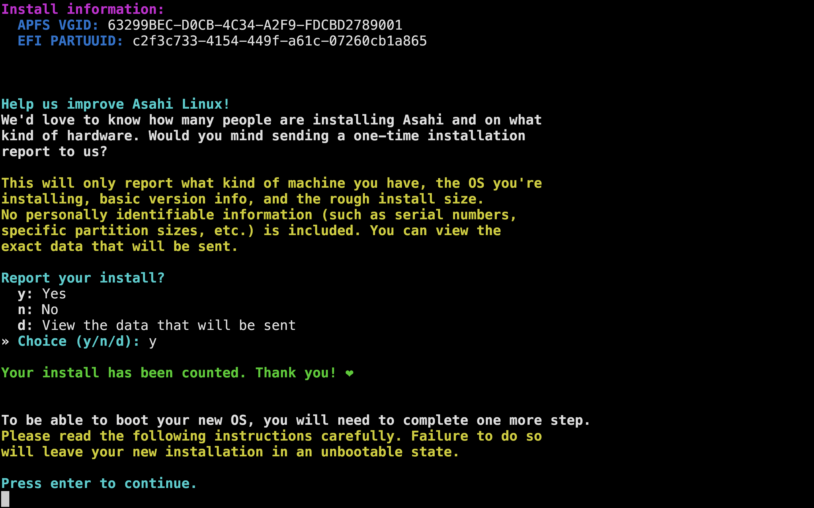
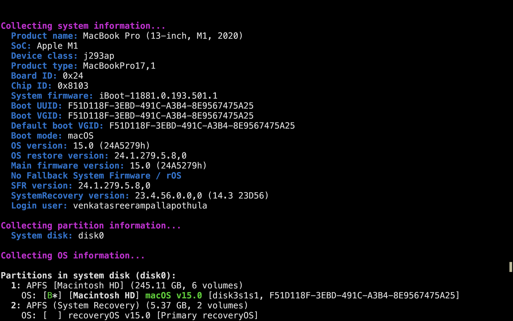
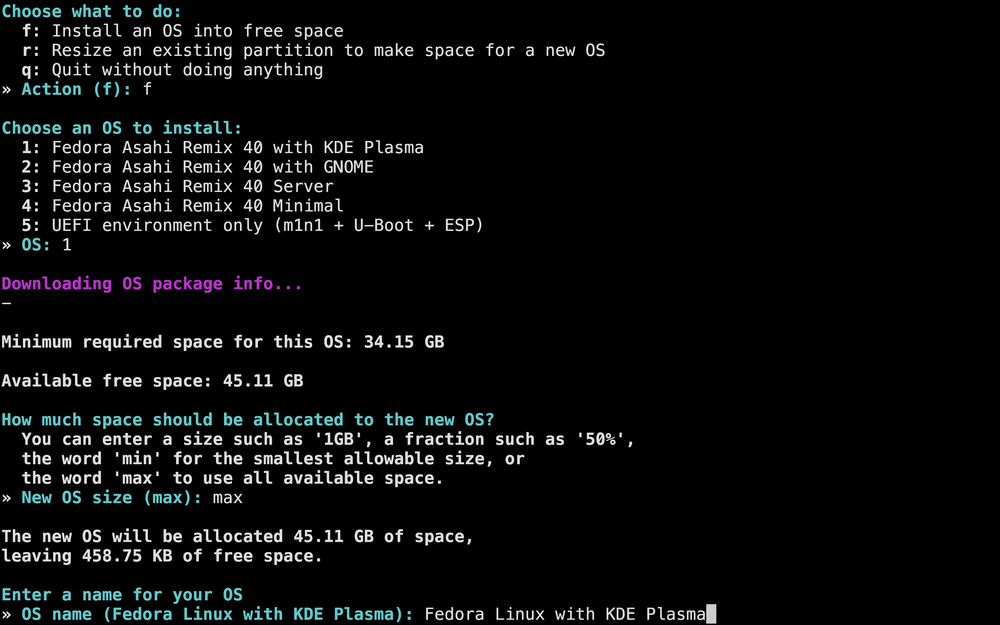
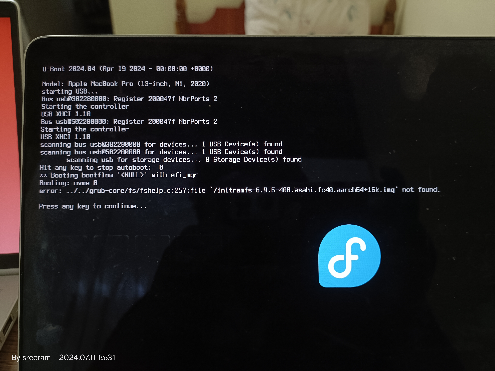

Asahi Linux is a project aimed at developing a Linux distribution for Apple Silicon Macs. The project's primary goal is to ensure that Linux runs smoothly on Apple's ARM-based processors. Intrigued by this initiative, I decided to give it a try.

## Installation
The installation process is very straightforward. You only need to run a single command to install the OS. It will prompt you for the partition size and other necessary OS information.

 
 
 

## Here are the advantages I've noticed:
* The installation process is smooth and simple.
* Battery usage is better than expected.
* It’s faster than macOS. Opening applications or running commands in Kitty is significantly faster than on macOS. This speed is particularly noticeable when browsing with Firefox.

## Issues I’ve Encountered:
* i3 is not supported: I tried to use it, but it didn’t boot. However, it is perfectly compatible with Hyperland.
* System crash during Google Meet screen sharing: The system crashed when I attempted to screen share on Google Meet. Closing and reopening the lid didn’t resolve the issue. I had to hold the power button for an extended period to restart the system.

 

* No gesture support with the trackpad: Gestures are not supported with the trackpad, and if you have a Touch Bar, it’s essentially useless.

## Conclusion
The Asahi Linux team is making significant strides in bringing the flexibility and power of Linux to Apple Silicon Macs, despite the limited information available about Apple’s proprietary hardware. In my opinion the progress so far is promising. I hope I can use asahi linux as my daily driver someday.