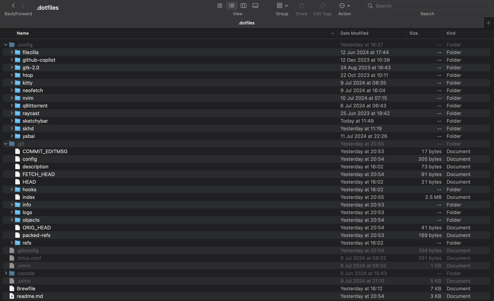

Dot files (or dotfiles) are configuration files on Unix-like systems (such as Linux and macOS) that are often hidden because their filenames begin with a dot (e.g., .bashrc, .vimrc). 
These files typically control various settings and behaviors of applications and the shell environment. Users often customize dot files to tailor their computing environment to their preferences, such as configuring shell prompts, aliases, key bindings, and other settings specific to applications like Vim, Git, or even desktop environments. 
They are called dot files because their filenames start with a dot, making them hidden by default in directory listings unless explicitly shown.

I’ve shared my dot files on github here.

## Sketchybar
This bar project aims to create a highly flexible, customizable, fast and powerful status bar replacement for people that like playing with shell scripts.
The main design principle of this project is that all elements of the bar can be added, removed and freely changed at any point in time. Thus, the configuration of the bar is not static, rather it is possible to adapt the appearance of the bar completely dynamically with the help of a powerful event-driven scripting system at any point in time using the highly configurable basic building blocks SketchyBar offers.
Configuration file is located in ~/.config/sketchybar, we can modify the bar according to our needs.

## Yabai
yabai is a window management utility that is designed to work as an extension to the built-in window manager of macOS. yabai allows you to control your windows, spaces and displays freely using an intuitive command line interface and optionally set user-defined keyboard shortcuts using ↗ skhd and other third-party software.
skhd is a simple hotkey daemon for macOS that focuses on responsiveness and performance. Hotkeys are defined in a text file through a simple DSL. skhd is able to hotload its config file, meaning that hotkeys can be edited and updated live while skhd is running.

## vscode vim

space and v to toggle vim
space and c to comment and uncomment multiple lines 
cmd+d to multi cursor to replace
cmd+shift+. to display different parts of the code
ctrl+z for zen mode
cmd+j for terminal
~ to change the capital or small
ctrl+a to increment and +x for decerement
* to search for that word

I back up my dot files periodically. I can download thse from github and create the same development environment on any unix based device.
