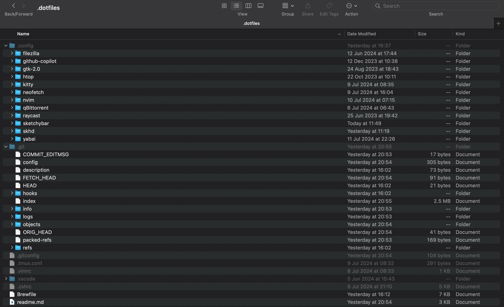

**Dot files** (or dotfiles) are configuration files found on Unix-like systems (such as Linux and macOS). These files control various settings and behaviors of applications and the shell environment. Users frequently customize dot files to tailor their computing environment to their preferences, such as configuring shell prompts, aliases, key bindings, and settings specific to applications like Vim, Git, or desktop environments. The dot in their filenames makes them hidden by default in directory listings unless explicitly shown.

I’ve shared my dot files on GitHub. You can check them out [here](https://github.com/sreeram2022/dotfiles).



I've covered my Zsh and Vim configuration files in previous posts.

## Sketchybar

**Sketchybar** is a highly flexible, customizable, fast, and powerful status bar replacement designed for those who enjoy working with shell scripts. The main design principle is that all elements of the bar can be added, removed, and changed dynamically. 

The configuration file for Sketchybar is located in `~/.config/sketchybar`. You can modify the bar according to your needs.

## Yabai

**Yabai** is a window management utility designed to extend the built-in window manager of macOS. It allows you to control your windows, spaces, and displays. It's kind of an alternative to i3 in linux. Yabai can be combined with `skhd`, a hotkey daemon for macOS, to set user-defined keyboard shortcuts.

**skhd** focuses on responsiveness and performance. Hotkeys are defined in a text file through a simple DSL, and skhd can hotload its configuration file, meaning that hotkeys can be edited and updated live while skhd is running.

## VSCode Vim Integration

It stores all the extensions and settings of the VScode.
This is a part of my settings.json:

```json
 "vim.easymotion": true,
    "vim.incsearch": true,
    "vim.useSystemClipboard": true,
    "vim.useCtrlKeys": true,
    "vim.hlsearch": true,
    "vim.insertModeKeyBindings": [
        {
        "before": ["j", "k"],
        "after": ["<Esc>"]
        }
    ],
    "vim.normalModeKeyBindingsNonRecursive": [
        
        {"before": ["<leader>", "v"],"commands": [":vsplit"]},
        {"before": ["<leader>", "s"],"commands": [":split"]},

        {"before": ["<leader>", "h"],"commands": [":bprevious"]},
        {"before": ["<leader>", "l"],"commands": [":bnext"]},
      
        {"before": ["<leader>", "n","e"],
        "commands": ["workbench.explorer.fileView.focus"] },

        
          {
            "before": ["leader", "j"],
            "commands": ["workbench.action.focusBelowGroup"]
          },
          {
            "before": ["leader", "k"],
            "commands": ["workbench.action.focusAboveGroup"]
          },
          
          // NICE TO HAVE
          { "before": ["leader", "w"], "commands": [":w!"] },
          { "before": ["leader", "q"], "commands": [":q!"] },
        
        


    ],
    "vim.visualModeKeyBindings": [
        // Stay in visual mode while indenting
        { "before": ["<"], "commands": ["editor.action.outdentLines"] },
        { "before": [">"], "commands": ["editor.action.indentLines"] },
        // Move selected lines while staying in visual mode
        { "before": ["J"], "commands": ["editor.action.moveLinesDownAction"] },
        { "before": ["K"], "commands": ["editor.action.moveLinesUpAction"] },
        // toggle comment selection
        { "before": ["leader", "c"], "commands": ["editor.action.commentLine"] }
      ],
    "vim.leader": "<space>", 
```

Apart from these, I haven't modified other configuration files. However, you can adjust the settings and behavior of those applications through their respective configuration files.

## Backup and Restore

I back up my dot files periodically. By downloading them from GitHub, I can recreate the same development environment on any Unix-based device. This ensures that my setup remains consistent across different machines.
