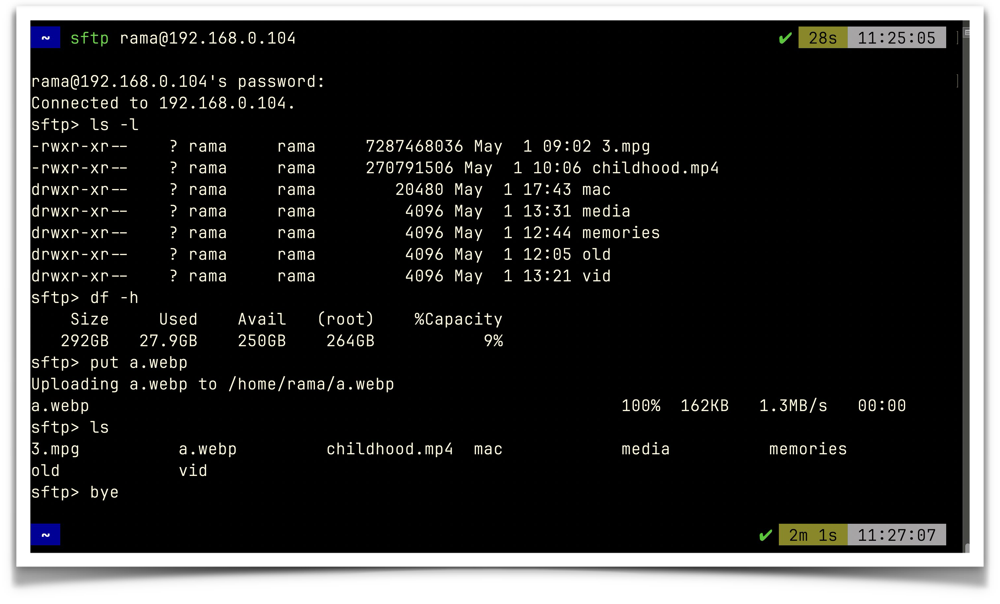
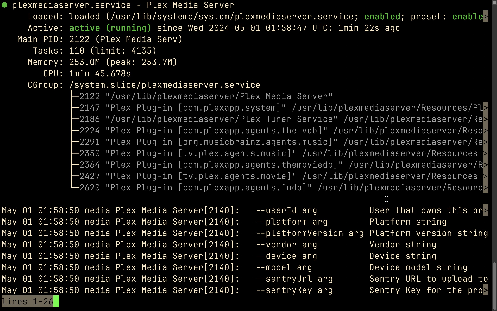

Ubuntu Server is a version of the Ubuntu operating system specifically designed for use on servers and in data centers. Unlike the desktop version, it does not include a graphical user interface (GUI) by default, making it more lightweight and better suited for server tasks such as web hosting, file serving, email hosting, and database management. Ubuntu Server is known for its stability, security, and ease of use, and it is widely used in enterprise environments.

I’ve installed ubuntu server on my old lenovo laptop.
## setup

Download Ubuntu Server ISO:
Create a Bootable USB Drive:
Boot from the USB Drive:
Install Ubuntu Server: self explanatory 
Select your language and keyboard layout.
Follow the on-screen instructions to configure your network settings, select the installation drive, and set up the storage configuration.
Create a user account and set a password.
Select the software you want to install (e.g., OpenSSH server for remote access, LAMP server for web hosting).
Review your choices and start the installation process.

Post-Installation Setup:
sudo apt update
sudo apt upgrade


If I want to access via sftp in terminal the commands:

sftp rama@192.168.0.104 (give your ip address after your server name)

- We can even access through a file manager for ease of access. If we have a
  linux os it'll be free and easy. If we want to access it from mac we need to
  pay for third party softwares.

- But using terminal we can still access and perform necessary operations.

## Basic commands

```


put:- for uploading files to server

#To upload a complete folder, first create a folder with the same name then put -r foldername

get:- downloading files from server

bye:- to exit from server.

```

 


## plex
Plex is a popular media server and client application that allows you to organize, stream, and access your personal media collections such as movies, TV shows, music, photos, and more. It enables users to centralize their media content on a server and access it from various devices like smartphones, tablets, smart TVs, computers, and streaming devices, both locally and remotely.

Remote Access:
* Allows you to access your media library from anywhere with an internet connection.
* Securely share your media library with friends and family.

 

I can access our plex media server through http://192.168.0.118:32400/web.
But I couldn’t properly configured plex. So I left it for future todo.
Anyway I can access my local server using vpn, I’ll probably setup later.


I’ve installed ubuntu server on my old lenovo laptop.
The ip address is 192.168.0.118
In the time of necessity, turn on the laptop by plugging charging cable and always keep it on. Connect ethernet.
It’ll ask for credentials after booting
ID: rama passoword: Chanakya#01
If we want to update the server by “sudo apt update”.
If we want to access via sftp in terminal the commands:
sftp://rama@192.168.0.118
Password: Chanakya#01
* We can even access through finder or any file manager. (ease of access)
But with terminal
put:- for uploading files to server
To upload a complete folder, first create a folder with the same name then
put -r foldername
get:- downloading files from server
exit to exit from server.
we can access our plex media server through http://192.168.0.118:32400/web.
I tried to access again now the ip change to
sftp rama@192.168.0.104
so if we can’t access run ifconfig command to know ip address.
