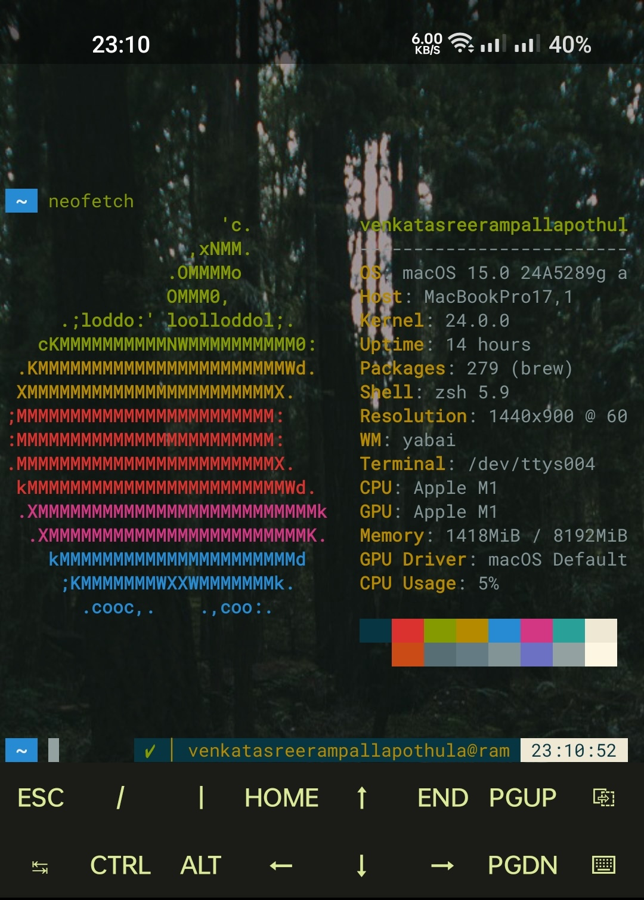

Termux is a terminal emulator and Linux environment app for Android that allows users to run a Linux distribution on their Android devices. It provides a command-line interface and access to a large collection of Linux packages, making it possible to perform a wide range of tasks that are typically done on a Linux desktop or server. Termux is popular among developers, system administrators, and tech enthusiasts for its versatility and ease of use.

I’ve installed Termux: styling: A Termux add-on app to customize the terminal font and color theme.

Package Management:
* Uses the pkg command to manage software packages, similar to apt on Debian-based systems.

* pkg update: Updates the local package database.
* pkg upgrade: Upgrades all installed packages.
* pkg install {package_name}: To installs a packages like git, Python ect.
* pkg uninstall {package_name}: To uninstalls a package.
* pkg search {keyword}: Search for packages containing the specified keyword.
* pkg list-all: To see the lists of all available packages.
* pkg list-installed: To see the lists of all installed packages.
* pkg list-updates: Lists packages with available updates.

Development Environment:
* Supports a variety of programming languages and frameworks, such as Python, Node.js, Ruby, Java, and more.
Remote Access:
* Can be used to connect to remote servers via SSH.
* Supports tools like tmux for terminal multiplexing and nano or vim for text editing.

# image
 

Customizability:
* Users can customize the appearance and behavior of the terminal emulator.
* Supports the installation of additional shells, such as Zsh, along with customization frameworks like Oh My Zsh.
File Management:
* Access the Android file system and perform file management tasks using standard Linux commands.

* cd {directory_name} : Move to specific directory.
* cd : Go back to the past directory.
* cd $HOME : Change the current directory to the home directory.
* ls : To see files and directories in the current directory.
* ls -a: To see hidden files.
* pwd: Print working directory.
* cp {file_name} : Copy files or directories.
* rm {file_name} : Remove (delete) a file.
* rm -rf {directory_name} : Delete a directory and its contents.
* touch {file_name} : To create a new file.
* mkdir {directory_name} : Use this command to create a new directory.

Networking commands:
You can do many networking-related tasks in Termux. Here’s the some basic networking Termux commands list:
* pkg install nmap : To install Nmap in Termux.
* nmap {Ip_address} : To scan a network.
* ifconfig : To see your network informations.
* curl {url} : To display or download a web page.
* wget {url} : To download a file from a URL.

System and Processes management commands:
Termux has many system and process management commands to control and manage Android devices efficiently. Here are some system and process management Termux commands list:
* top : To see device CPU, memory, and other resource usage.
* ps : List of all running processes with process IDs.
* kill {process_id} : To kill a process with process ID.
* uname -a : Display system information like the kernel version, system architecture, and hostname.
* uptime : Shows how long the system has been running.
* free : To see the system used memory and free memory.
* du : To see the disk usage for files and directories.

Termux api

"sensors": [    "icm4n607 ACCELEROMETER",    "akm09918 MAGNETOMETER",    "icm4n607 GYROSCOPE",    "tcs3701 PROXIMITY",    "UNCALI_MAG",    "UNCALI_GYRO",    "SIGNIFICANT_MOTION",    "STEP_DETECTOR",    "STEP_COUNTER",    "WAKE_GESTURE",    "DEVICE_ORIENTATION",    "STATIONARY_DETECT",    "UNCALI_ACC",    "sx933x SAR",    "tcs3701 LIGHT",    "RAW_MAG",    "ai_shutter",    "STEP_DETECTOR_WAKEUP",    "OPLUS Fusion Light Sensor",    "OPLUS Side Panel Fusion Light Sensor",    "PICKUP_DETECT",    "LUX_AOD",    "PEDO_MINUTE",    "Game Rotation Vector Sensor",    "GeoMag Rotation Vector Sensor",    "Gravity Sensor",    "Linear Acceleration Sensor",    "Rotation Vector Sensor",    "Orientation Sensor"  ]}

Locayiotion also
