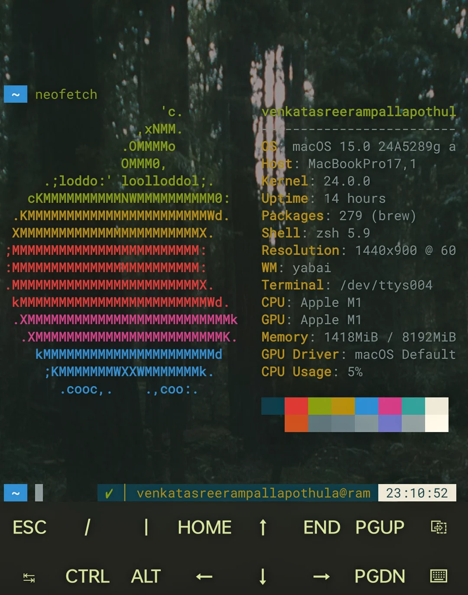

# Termux: The Linux Terminal on Android

For those of you who don't know what the Termux is , it's a terminal emulator for Android that allows users to run a Linux commands & even a distribution on their Android devices. It provides a command-line interface and access to a vast collection of Linux packages. In this article I give an overview of Termux, its capabilities, and some essential commands.
You can also install **Termux: Styling**, a Termux add-on app to customize the terminal font and color theme.

 

## Package Management

Termux uses the `pkg` command to manage software packages, similar to `apt` on Debian-based systems. Here's how you can manage packages in Termux:

- `pkg update`: Updates the local package database.
- `pkg upgrade`: Upgrades all installed packages.
- `pkg install {package_name}`: Installs a package (e.g., git, Python).
- `pkg uninstall {package_name}`: Uninstalls a package.
- `pkg search {keyword}`: Searches for packages containing the specified keyword.
- `pkg list-all`: Lists all available packages.
- `pkg list-installed`: Lists all installed packages.
- `pkg list-updates`: Lists packages with available updates.

## Development Environment

Termux supports a variety of programming languages and frameworks, making it a powerful tool for development on the go:

- **Languages**: Python, Node.js, Ruby, Java, and more.
- **Tools**: Compilers, interpreters, and development tools are readily available.

You can connect to remote servers via SSH, and Termux supports terminal multiplexing with tools like `tmux`, as well as text editing with `nano` or `vim`

- **Appearance**: Customize the look and feel of your terminal using add-ons like Termux: Styling.
- **Shells**: Install additional shells, such as Zsh, and use frameworks like Oh My Zsh for further customization.

## File Management

Termux provides access to the Android file system, these are the same standard Linux commands:

- `cd {directory_name}`: Move to a specific directory.
- `cd`: Go back to the previous directory.
- `cd $HOME`: Change the current directory to the home directory.
- `ls`: List files and directories in the current directory.
- `ls -a`: List hidden files.
- `pwd`: Print the current working directory.
- `cp {file_name}`: Copy files or directories.
- `rm {file_name}`: Remove (delete) a file.
- `rm -rf {directory_name}`: Delete a directory and its contents.
- `touch {file_name}`: Create a new file.
- `mkdir {directory_name}`: Create a new directory.

## System and Process Management Commands

Termux offers a range of commands to manage system processes:

- `top`: Display CPU, memory, and other resource usage.
- `ps`: List all running processes with process IDs.
- `kill {process_id}`: Kill a process by its process ID.
- `uname -a`: Display system information like the kernel version, system architecture, and hostname.
- `uptime`: Show how long the system has been running.
- `free`: Display used and free memory.
- `du`: Show disk usage for files and directories.

## Termux API

Termux also provides a powerful API that allows you to interact with various Android features directly from the terminal. Here's an example:

### Sensor Information

You can get information about the types of sensors and live data with:

```bash
termux-sensor
```
This command returns data from sensors such as the accelerometer, gyroscope, proximity sensor, and more.

>"sensors": [    "icm4n607 ACCELEROMETER",    "akm09918 MAGNETOMETER",    "icm4n607 GYROSCOPE",    "tcs3701 PROXIMITY",    "UNCALI_MAG",    "UNCALI_GYRO",    "SIGNIFICANT_MOTION",    "STEP_DETECTOR",    "STEP_COUNTER",    "WAKE_GESTURE",    "DEVICE_ORIENTATION",    "STATIONARY_DETECT",    "UNCALI_ACC",    "sx933x SAR",    "tcs3701 LIGHT",    "RAW_MAG",    "ai_shutter",    "STEP_DETECTOR_WAKEUP",    "OPLUS Fusion Light Sensor",    "OPLUS Side Panel Fusion Light Sensor",    "PICKUP_DETECT",    "LUX_AOD",    "PEDO_MINUTE",    "Game Rotation Vector Sensor",    "GeoMag Rotation Vector Sensor",    "Gravity Sensor",    "Linear Acceleration Sensor",    "Rotation Vector Sensor",    "Orientation Sensor"  ]

I won't list everything the Termux API can do, but it allows us to control various aspects of the device, such as Wi-Fi settings, the camera, battery status, location, and more. To get all of the commands visit [Termux wiki](https://wiki.termux.com/wiki/Termux:API).

## Conclusion

All in all, I had fun using Termux. It's incredible how much power and flexibility this app brings to an Android device. It’s been a rewarding experience exploring its capabilities. If you're someone who enjoys diving deep into the command line or needs a powerful toolset on your mobile, Termux is a must-have.


