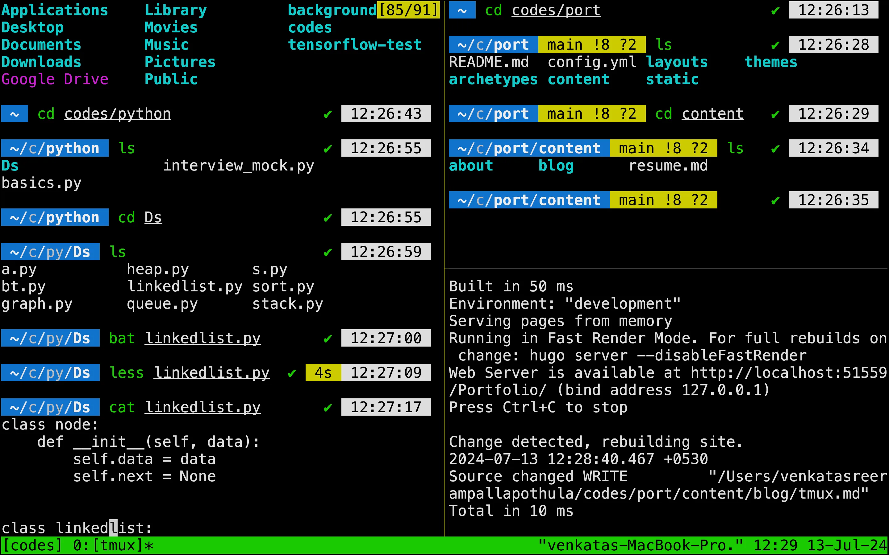

Tmux is a terminal multiplexer that allows us to manage multiple terminal
sessions within a single window. It provides a way to easily switch between different sessions, split windows into panes, and maintain persistent sessions that can be reattached even after disconnecting.all of the commands have prefix Ctrl+b by default. But,I changed ctrl+b to shift+b as it is more accessible for me.

## Essential Tmux Commands

> - `tmux`  - for new session
> - ` tmux ls ` - for list of all the session
> - ` tmux new ` -s session name- to create a new session (s for session)
> - ` tmux a`  -t session name- to enter into a session(t for target)
> - ` shift+b`  d to detach from session
> - ` tmux kill-session` - to close a session

> - ` shift+b %`  for vertical panes
> - ` shift+b “`  for horizontal panes
> - ` shift+b x`  to close pane
> - ` shift+b Arrow Key (Left, Right, Up, Down)`  — Move between panes.

> - ` shift+B C`  — Create a new window.
> - ` shift+B N or P`  — Move to the next or previous window.
> - ` shift+B 0 (1,2...)`  — Move to a specific window by number.
> - ` shift+B ?`  — View all keybindings. Press Q to exit.

> - `shift+b [`for copying mode & same with `]` for pasing, use y to copy (just like in vim) to paste in system clipboard.

## My tmux config

I often use Tmux exclusively with the keyboard for efficiency. However, when I’m feeling lazy and slouching on sofa, it’s convenient to have mouse access. Tmux allows toggling mouse support on or off with the command set -g mouse. This lets me scroll, select panes, and interact with the terminal using the mouse.

 

```bash
set -s escape-time 0
bind -T copy-mode-vi y send-keys -X copy-pipe-and-cancel "pbcopy"

unbind C-b
bind B send-prefix
set-option -g prefix B

set -g mouse on
setw -g mode-keys vi
set -s escape-time 0
set -g default-terminal "screen-256color"
set -ga terminal-overrides ",xterm-256color:Tc"

```
### Key Configuration Details:


* set -s escape-time 0
This reduces the escape delay, making the Tmux experience more responsive, especially when switching between modes.

* unbind C-b
bind B send-prefix
set-option -g prefix B
These lines unbind the default Ctrl+b prefix and set Shift+b as the new prefix, making it more accessible.

* Vim-like Keybindings:
setw -g mode-keys vi
Enables Vim-style keybindings in copy mode, making it familiar for those who use Vim.

* 256-Color Support:
set -g default-terminal "screen-256color"
set -ga terminal-overrides ",xterm-256color:Tc"
Ensures that Tmux uses 256-color support, improving the appearance of terminal applications that rely on color.

## Conclusion

While Tmux offers extensive customization options, my setup is simple and efficient, perfectly suited to my workflow. Though there are plenty of additional features and configurations available, this setup provides everything I need to manage my terminal sessions effectively.