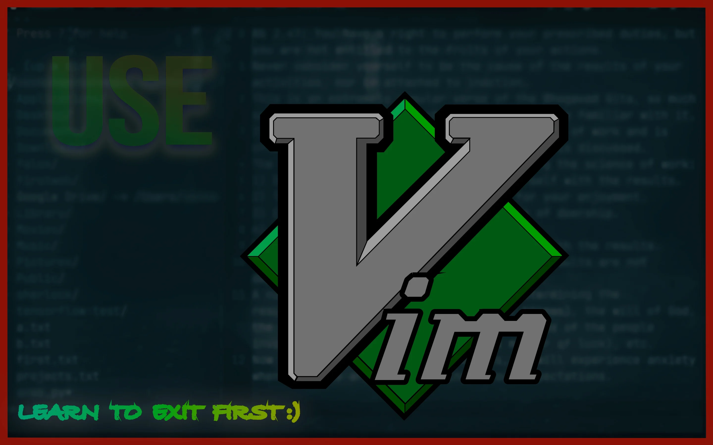
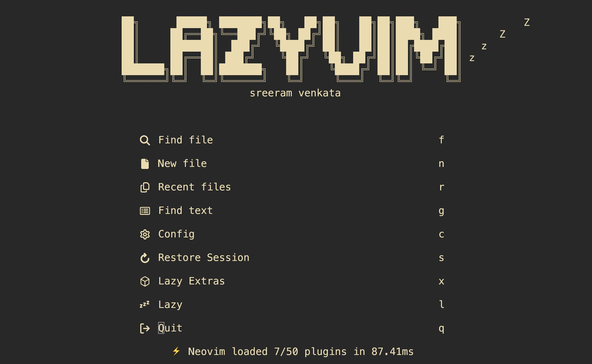
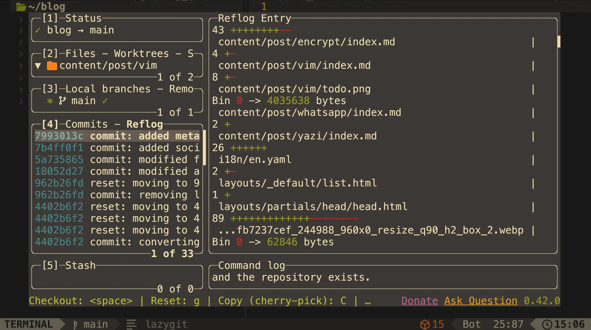
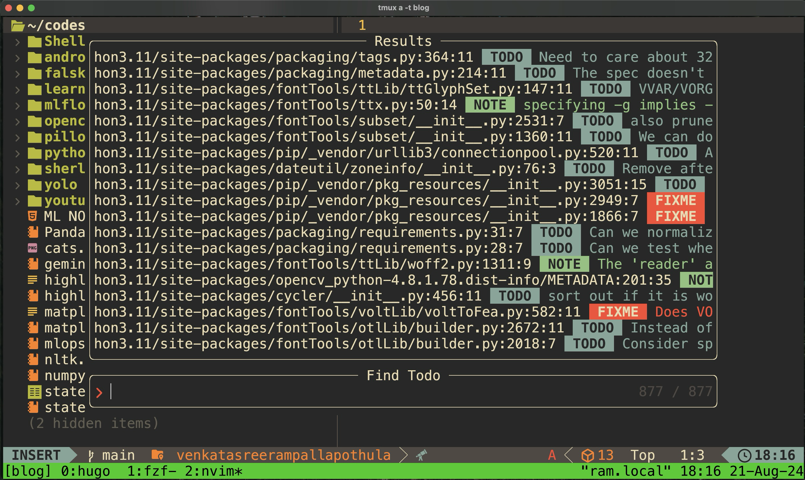
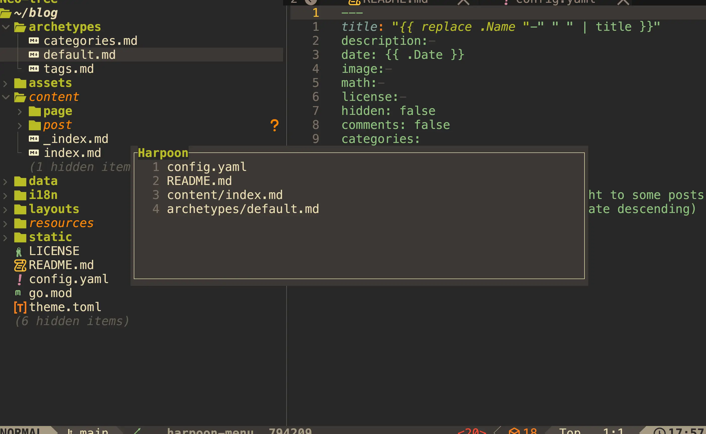

## Vim

Vim is a powerful text editor renowned for its efficiency, speed, and customizability. When I first encountered Vim, it felt overwhelming due to the vast array of commands. Even exiting the editor required entering `:wq` or `:q!`, which seemed cumbersome for simple text editing. I questioned the need to learn all these shortcuts just to edit a text file. However, after watching a few videos by [ThePrimeagen](https://www.youtube.com/c/ThePrimeagen), I was inspired to dive into Vim. It wasn't easy though, I had an on-and-off relationship with it. But after persevering, the effort paid off.

**My first "aha!" moment:**
I remember the first time I used Vim's visual mode to select and move blocks of code—it felt like magic! Suddenly, editing text was faster and more fun than ever before.

**Favorite plugin:**
I can't live without NERDTree. Navigating files with just a few keystrokes makes me feel like a true power user.

**Beginner tip:**
Don't try to learn everything at once. Start with basic navigation and editing, then gradually add new commands and plugins as you get comfortable.



### Modes

Vim is a modal editor, meaning it operates in different modes that define how the keyboard behaves:

- **Normal Mode**: The default mode, where you can navigate through the text and perform operations like copying, pasting, and deleting.
- **Insert Mode**: In this mode, you can enter and edit text.
- **Visual Mode**: This mode allows you to select blocks of text for manipulation.
- **Command-Line Mode**: Used to execute commands, search, and run external commands.

There are many commands to learn, especially for entering and exiting specific modes. Rather than listing them all here, I recommend checking out [this Vim cheat sheet](https://vim.rtorr.com) for a comprehensive guide.

### Plugin System

Vim's functionality can be extended with plugins, making it a highly customizable editor.

Some popular plugins include:

- **Pathogen/Vundle/Plug**: Plugin managers that simplify installing and managing plugins.
- **NERDTree**: A file system explorer for Vim.
- **Airline/Lightline**: Status bar replacements that provide more information.
- **Fugitive**: A Git wrapper for Vim.
- **YouCompleteMe**: A code-completion engine.

### My Simple `.vimrc` Configuration

Vim can be customized using the .vimrc file, which resides in your home directory. Here you can define keybindings, settings, and plugins.

```vim
set mouse=a
set encoding=utf-8
set tabstop=2
set shiftwidth=2
set expandtab
set smarttab
set autoindent
set wrap
set smartcase
set showmatch
set title
set ruler
set et
set number relativenumber
set incsearch
set hlsearch
set autoread
set autowrite
set nobackup
set nowritebackup
set noswapfile
set nocompatible
set hidden
filetype plugin indent on
syntax on
inoremap jk <Esc>
" Vundle settings
set rtp+=~/.vim/bundle/Vundle.vim
call vundle#begin()
Plugin 'VundleVim/Vundle.vim'
Plugin 'scrooloose/nerdtree'
Plugin 'jistr/vim-nerdtree-tabs'
call vundle#end()

" Plugin-specific settings
nmap <F1> :NERDTreeToggle<CR>

let mapleader = "\<Space>"
nmap <leader>l :bnext<CR>
nmap <leader>h :bprevious<CR>
highlight Search ctermfg=grey ctermbg=red
highlight Macro ctermfg=cyan
highlight Special ctermfg=red
" Run Python file
function! RunPythonFile()
    w
    execute "!python3" shellescape(expand('%'))
endfunction
nnoremap <F2> :call RunPythonFile()<CR>
" Window split
nmap <leader>v :vsp<CR>

```
I created a keybinding jk to exit from Insert mode. Typically, you'd press Esc, but reaching for Esc every time can be a strain. Normally, you'd use :!python3 filename.py to run a Python file, but by adding #!/usr/bin/env python3 at the beginning of the Python file, you can simply press F2 to run it. To access NERDTree, press F1; you can toggle between buffers using Ctrl+w, or even use the mouse. Apart from these minor tweaks, I haven't customized much because I found a better alternative to plain Vim.

## lazyvim
  

LazyVim is a Neovim configuration framework designed to make Vim easier. It provides a robust and functional Neovim setup out of the box and is more user-friendly and efficient than plain Vim. It includes several plugins that are essential for my workflow. Here are a few:

### Lazygit
Lazygit is a simple, fast, terminal-based Git user interface designed to streamline your Git workflow. It allows you to customize keybindings to suit your preferences, making it very easy to stage, unstage, and commit changes.

 

### Todo Plugin
The Todo plugin allows you to add keywords like TODO, FIXME, NOTE, and others to your code. This makes it easy to come back and address them later.

  

### Harpoon
Harpoon is straightforward—it simplifies file navigation. You can add frequently modified files to the Harpoon menu, and by pressing the leader key followed by a number, you can quickly access that specific file.

  

LazyVim simplifies the process of configuring Neovim and helps users get up and running quickly with a functional development environment.

In conclusion, I believe LazyVim is a powerful tool that can significantly increase productivity. Although it has a steep learning curve, investing time in learning Vim pays off in the long run. The key is to start with the basics, practice regularly, and gradually incorporate more advanced features into your workflow.