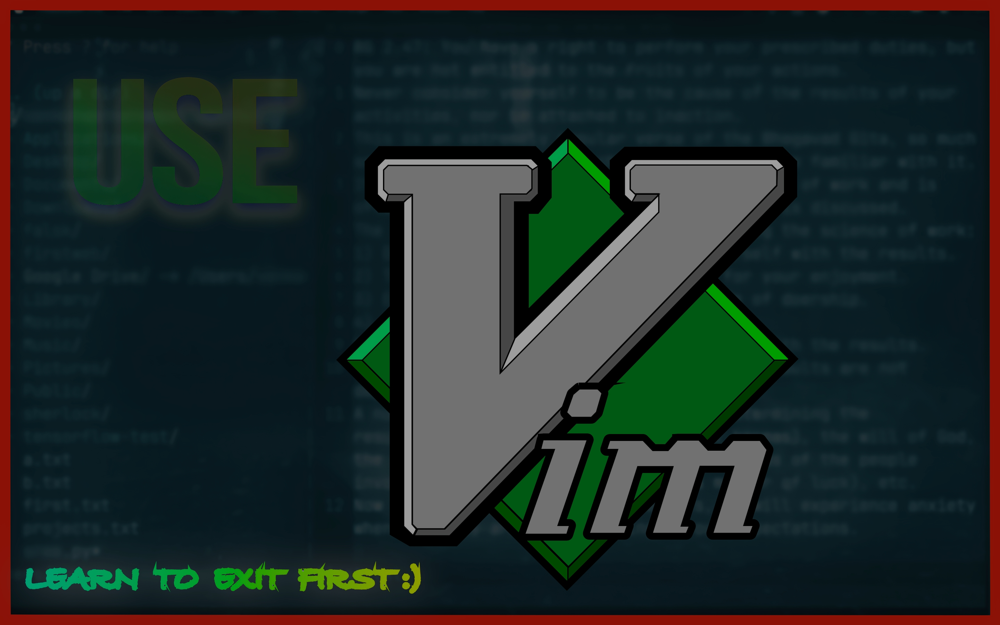

## Vim

Vim is a highly configurable and powerful text editor that is an improved version of the vi editor, which was originally created for the Unix operating system. Vim stands for "Vi IMproved" and is renowned for its efficiency, speed, and versatility in text editing tasks. It is commonly used by programmers and system administrators due to its extensive feature set and support for plugins.
 

I don’t need to list out the commands here. If you want check out https://vim.rtorr.com. 

## My usage:
 
we can give the file name or create a new file to split by mentioning the name after command. :! to run a terminal command, usually I use :!python3 filename.py to run the python file.
I have installed few pluggins; To access nerdtree press F1, you can toggle using ctrl+w or you can also use mouse. If you add #!/usr/bin/env python3 at the beginning of python file you can click F2 to run it or else you should run with :! command.

.vimrc Configuration:

## Lazyvim:

LazyVim is a Neovim configuration framework designed to make setting up and managing Neovim easier and more efficient. It emphasizes simplicity, performance, and ease of use, aiming to provide a robust and functional Neovim setup out of the box while still being highly customizable. LazyVim is built on top of Neovim and integrates various plugins and configurations to streamline the development environment.

Todo pluggin

LazyVim provides a robust starting point for Neovim users who want a well-organized, high-performance setup with the flexibility to customize and extend as needed. It simplifies the process of configuring Neovim and helps users get up and running quickly with a functional development environment.
