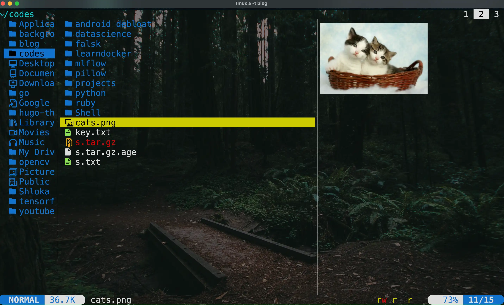

I've tried multiple terminal file managers like ranger, lf and nnn. Recently, there's a new file manager called yazi which was written in Rust. 

**Why I tried Yazi:**
I was looking for a file manager that felt fast and modern, and the buzz around Yazi in the Rust community caught my attention.

**Feature that surprised me:**
The scrollable preview for videos and PDFs is a game-changer. I never thought I'd preview a video right in my terminal!

**Tip for new users:**
Try out the bulk selection and renaming features—they save a ton of time when organizing files.

## Features

  

* It has Built-in Support for Multiple Image Protocols which no other file manager had.
* Scrollable Preview (for videos, PDFs, archives, directories, code, etc.) which is great.

* Vim-like input/select/which/notify component, auto-completion for cd paths.
* Theme System, Mouse Support, Trash Bin, Custom Layouts.
* Bulk selection & Renaming feature
* Creating tabs with t command and switching between them using tab number.

* Integration with ripgrep, fd, fzf, zoxide.

* it even Provides real-time progress updates, task cancellation, and internal task priority assignment.

