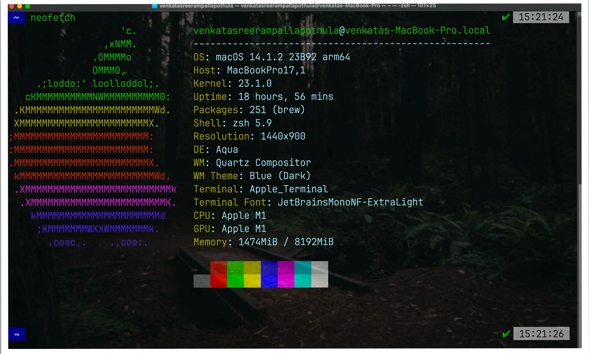

## My Zsh Setup

Let's talk about customizing the terminal on a Mac. By default, macOS comes with a basic terminal using Zsh (Z shell), which while functional, lacks visual appeal and many productivity features. However, with thoughtful configuration, you can transform it into a powerful, efficient, and visually stunning development environment.

**My terminal journey:**
When I first started using the terminal, I was intimidated by its text-only interface. For a long time, I didn't realize the potential of Zsh until I discovered various YouTube tutorials showcasing terminal customizations. What began as a simple desire to make my terminal look better quickly evolved into a quest for productivity. Now, I can't imagine working without my customized setup—it's become an extension of my thinking process when coding.

The productivity gains from a well-configured terminal environment have been substantial in my daily workflow, saving me countless hours and making development more enjoyable.

### Key Enhancements

After exploring various setups, I've settled on these essential components:

1. **Terminal Emulator**: I use **iTerm2** (though **kitty** is another excellent option) which offers split panes, robust search capabilities, and extensive customization options beyond the default Terminal app.

2. **Oh My Zsh Framework**: This community-driven framework manages Zsh configurations and provides:
   - Hundreds of useful plugins and themes
   - Intelligent tab completion
   - Command history with search functionality
   - Git integration with status indicators

3. **Powerlevel10k Theme**: This highly customizable prompt theme offers:
   - Contextual information display (git status, exit codes, command duration)
   - Customizable segments showing system information
   - Instant prompt feature for faster terminal startup
   - Excellent performance even with complex configurations

4. **Nerd Fonts**: I use **JetBrains Mono Nerd Font** which provides:
   - Programming ligatures for better code readability
   - Special glyphs and icons for developer tools
   - Consistent rendering across different applications

5. **Customized `.zshrc`**: My configuration includes:
   - Carefully selected plugins for development workflows
   - Custom aliases for frequent commands
   - Environment variables for development tools
   - Integration with package managers like Homebrew

6. **Visual Enhancements**: Including:
   - Slight terminal transparency for context awareness
   - Custom color schemes optimized for readability
   - Status line indicators for system information



### Learning Vim for Terminal Productivity

As I deepened my terminal customization journey, I realized that learning Vim would create a more cohesive and efficient workflow. Vim's keyboard-centric approach perfectly complements a customized terminal environment, allowing you to maintain focus without context switching between keyboard and mouse.

**My Vim Learning Journey:**

When I first started with Vim, I focused on mastering these essential configurations:

- **NERDTree File Explorer**: I configured it to open with `F1` and toggle with `Ctrl+w`, providing an intuitive file navigation system while maintaining Vim's keyboard-focused philosophy.

- **Execution Shortcuts**: For Python development, I set up a workflow using the shebang line (`#!/usr/bin/env python3`) and mapped `F2` to execute files directly, streamlining the code-test cycle.

As my proficiency grew, I explored more advanced Neovim configurations:

- **AstroVim**: A comprehensive, community-driven Neovim configuration
- **NvChad**: Known for its aesthetic UI and speed
- **LazyVim**: My current choice for its excellent balance of features, performance, and extensibility

The transition to Vim significantly improved my coding efficiency by eliminating the constant switching between keyboard and mouse. For a comprehensive guide to my Vim setup, check out my detailed post [here](https://venkatasreeram.com/post/vim/).

### Terminal Multiplexing with Tmux

To further enhance my terminal workflow, I integrated `tmux` - a terminal multiplexer that allows managing multiple terminal sessions within a single window. This powerful tool enables:

- **Session Persistence**: Keep terminal sessions running even after disconnecting
- **Window Management**: Split the terminal into multiple panes for simultaneous tasks
- **Workflow Organization**: Group related terminal activities into dedicated sessions
- **Remote Work Enhancement**: Maintain complex development environments over SSH connections

Tmux complements Zsh and Vim perfectly, creating a cohesive terminal environment that maximizes productivity. Learn more about my tmux configuration [here](https://venkatasreeram.com/post/tmux/).

## Leveraging Aliases for Workflow Efficiency

One of the most powerful aspects of Zsh is the ability to create custom aliases. By learning basic shell scripting, I've been able to significantly streamline repetitive terminal tasks and automate complex command sequences.

Aliases serve multiple purposes in my workflow:

- **Reducing Keystrokes**: Shortening frequently used commands
- **Standardizing Commands**: Creating consistent interfaces across different systems
- **Automating Sequences**: Combining multiple commands into a single operation
- **Enhancing Safety**: Adding confirmation prompts to potentially destructive commands

### Practical Alias Examples

Here's a selection of aliases from my `.zshrc` that demonstrate these principles:

```sh
# Basic Aliases
alias ll='ls -la'               # List files with detailed info
alias g='git'                   # Shorten 'git' command
alias ..='cd ..'                # Move up one directory
alias ...='cd ../..'            # Move up two directories

# Useful Commands
alias c='clear'                # Clear the terminal screen
alias h='history'              # Show command history
alias py='python3'             # Use python3 for 'py'

# macOS Specific Commands
alias def='defaults'               # Access macOS defaults system
alias saytessa='say -V tessa'      # Use macOS TTS with the Tessa voice

alias editzsh='nvim ~/.zshrc' #Editign .zshrc from anywhere
alias vimrc='nvim ~/.vimrc' #Editign .vimrc from anywhere

alias gacp='f() { git add . && git commit -m "$1" && git push origin main; }; f'


```

## Homebrew: The Missing Package Manager

Homebrew has become an essential tool in my development environment. As a package manager designed specifically for macOS (and now Linux), it elegantly solves the problem of software installation and management on Unix-based systems.

### Why Homebrew is Essential

Homebrew offers several advantages that make it indispensable for my workflow:

- **Simplified Installation**: Install, update, and manage packages with simple commands
- **Non-privileged Installation**: Installs packages without requiring sudo access
- **Dependency Management**: Automatically handles dependencies between packages
- **Formula System**: Community-maintained recipes for thousands of applications
- **Cask Support**: Easily install GUI applications alongside command-line tools
- **Consistency**: Creates a predictable environment across different machines

### Essential Homebrew Commands

| Command | Description | Use Case |
|---------|-------------|----------|
| `brew install git` | Install a package | Adding new tools to your system |
| `brew uninstall git` | Remove a package | Cleaning up unused applications |
| `brew upgrade git` | Update a specific package | Getting the latest features |
| `brew unlink git` | Disable a package temporarily | Testing without a package |
| `brew link git` | Re-enable a package | Restoring functionality |
| `brew info git` | View package details | Learning about dependencies |
| `brew cleanup git` | Remove old versions | Freeing up disk space |
| `brew update` | Update Homebrew itself | Keeping formulas current |
| `brew upgrade` | Update all packages | System-wide maintenance |
| `brew list` | Show installed packages | Auditing your environment |
| `brew doctor` | Diagnose issues | Troubleshooting problems |

### Beyond Productivity

Beyond the essential development tools, Homebrew also provides access to fun and interesting command-line applications that enhance the terminal experience:

- **`cmatrix`**: Create a Matrix-like screen effect
- **`tetris`**: Play Tetris in your terminal
- **`lynx`**: Browse the web directly from the terminal
- **`sl`**: Watch a steam locomotive cross your terminal (a fun "typo" for `ls`)
- **`toilet`/`figlet`**: Generate ASCII art text banners

I've particularly found `lynx` useful as a lightweight web browser directly in the terminal, and I've enhanced my shell with various Homebrew-installed plugins for auto-completion and accessibility.
## My .zshrc Configuration

Below is my actual `.zshrc` configuration file that ties together all the components discussed in this post. I've organized it into logical sections with comments for clarity:

```shell
# Enable Powerlevel10k instant prompt for faster startup
if [[ -r "${XDG_CACHE_HOME:-$HOME/.cache}/p10k-instant-prompt-${(%):-%n}.zsh" ]]; then
  source "${XDG_CACHE_HOME:-$HOME/.cache}/p10k-instant-prompt-${(%):-%n}.zsh"
fi

# Language version manager configuration
export LUAVER_DIR="$HOME/.luaver"
[ -s "$LUAVER_DIR/luaver" ] && . "$LUAVER_DIR/luaver"

# Oh My Zsh configuration
export ZSH="$HOME/.oh-my-zsh"
PATH=$PATH:~/.local/bin
ZSH_THEME="powerlevel10k/powerlevel10k"

# Disable magic functions for better paste performance
DISABLE_MAGIC_FUNCTIONS="true"

# Load essential plugins
plugins=(git zsh-syntax-highlighting zsh-autosuggestions web-search)

# Initialize Oh My Zsh
source $ZSH/oh-my-zsh.sh

# Python configuration
alias python=/usr/bin/python3

# Navigation aliases
alias ll='ls -la'               # List files with detailed info
alias g='git'                   # Shorten 'git' command
alias ..='cd ..'                # Move up one directory
alias ...='cd ../..'            # Move up two directories

# Utility aliases
alias c='clear'                # Clear the terminal screen
alias h='history'              # Show command history
alias py='python3'             # Use python3 for 'py'

# macOS specific aliases
alias def='defaults'               # Access macOS defaults system
alias saytessa='say -V tessa'      # Use macOS TTS with the Tessa voice

# Editor shortcuts
alias editzsh='nvim ~/.zshrc'   # Edit .zshrc from anywhere
alias vimrc='nvim ~/.vimrc'     # Edit .vimrc from anywhere

# Conda environment setup
__conda_setup="$('/opt/homebrew/Caskroom/miniforge/base/bin/conda' 'shell.zsh' 'hook' 2> /dev/null)"
if [ $? -eq 0 ]; then
    eval "$__conda_setup"
else
    if [ -f "/opt/homebrew/Caskroom/miniforge/base/etc/profile.d/conda.sh" ]; then
        . "/opt/homebrew/Caskroom/miniforge/base/etc/profile.d/conda.sh"
    else
        export PATH="/opt/homebrew/Caskroom/miniforge/base/bin:$PATH"
    fi
fi
unset __conda_setup

# Load Powerlevel10k configuration
[[ ! -f ~/.p10k.zsh ]] || source ~/.p10k.zsh

# History configuration
HISTSIZE=10000

# Git workflow automation
alias gacp='f() { git add . && git commit -m "$1" && git push origin main; }; f'
```

### Dotfiles Management

I [backup my dotfiles](https://venkatasreeram.com/post/dotfiles/) (especially `.zshrc` and `.vimrc`) periodically using a Git repository. This practice ensures my configurations are:

- **Safe**: Protected against accidental deletion or corruption
- **Portable**: Easily transferable to new machines
- **Versioned**: Changes are tracked over time
- **Consistent**: Maintaining the same environment across different systems

## Conclusion: The Power of Terminal Customization

Transforming your terminal from a basic text interface into a powerful development environment requires some initial investment of time, but the productivity gains are substantial. My journey with Zsh customization has taught me that:

1. **Small improvements compound**: Each customization adds incremental value that builds over time
2. **Consistency matters**: A unified approach to terminal, editor, and multiplexer creates a seamless workflow
3. **Automation saves time**: Well-crafted aliases and functions eliminate repetitive tasks
4. **Visual cues enhance productivity**: Thoughtful theming provides important contextual information at a glance

Whether you're a seasoned developer or just starting your journey, investing in your terminal environment will pay dividends in productivity and enjoyment. I encourage you to experiment with the tools and configurations shared in this post, adapting them to your own workflow and preferences.

Remember that the perfect setup is the one that works best for you. Start small, iterate often, and enjoy the process of crafting your ideal development environment.